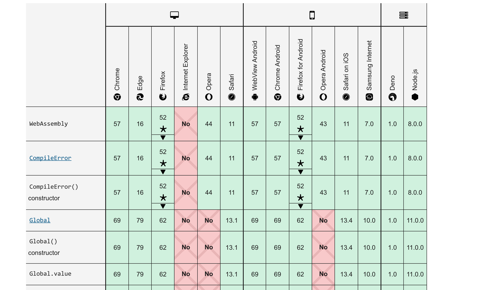

# canvas

canvas是一个可以使用脚本(通常为JavaScript, 也可以用[WASM](https://www.zhihu.com/question/304577684/answer/544879503))来绘制图形的 HTML 元素.它可以用于动画、游戏画面、数据可视化、图片编辑以及实时视频处理等方面。

Canvas API主要聚焦于2D图形。而同样使用<canvas>元素的 WebGL API 则用于绘制硬件加速的2D和3D图形。

>简单说一下wasm
>
>对于网络平台而言，WebAssembly具有巨大的意义——它提供了一条途径，以使得以各种语言编写的代码都可以**以接近原生的速度**在Web中运行。
>
>在这种情况下，以前无法以此方式运行的客户端软件都将可以运行在Web中。
>
><h3>支持情况</h3>
>
>🥚 - 开发中
>🐣 - 未稳定版本
>🐥 - 稳定版本
>
>--------------
>
>🐥 [C](https://github.com/appcypher/awesome-wasm-langs#c)
>🐥 [C#](https://github.com/appcypher/awesome-wasm-langs#csharp)
>🐥 [C++](https://github.com/appcypher/awesome-wasm-langs#cpp)
>🐥 [Go](https://github.com/appcypher/awesome-wasm-langs#go)
>🐣 [Java](https://github.com/appcypher/awesome-wasm-langs#java)
>🐣 [JavaScript](https://github.com/appcypher/awesome-wasm-langs#javascript)
>🐣 [Ruby](https://github.com/appcypher/awesome-wasm-langs#ruby)
>🐥 [Rust](https://github.com/appcypher/awesome-wasm-langs#rust)
>🐣 [Python](https://github.com/appcypher/awesome-wasm-langs#python)
>🐥 [TypeScript](https://github.com/appcypher/awesome-wasm-langs#typescript)
>🐣 [PHP](https://github.com/appcypher/awesome-wasm-langs#php)
>🐣 [Swift](https://github.com/appcypher/awesome-wasm-langs#swift)
>🐥 [Lua](https://github.com/appcypher/awesome-wasm-langs#lua)
>🐥 [.Net](https://github.com/appcypher/awesome-wasm-langs#dotnet)
>
>🐥 [AssemblyScript](https://github.com/appcypher/awesome-wasm-langs#assemblyscript)
>🥚 ~~[Astro](https://github.com/appcypher/awesome-wasm-langs#astro)~~ `Unmaintained`
>🐥 [Brainfuck](https://github.com/appcypher/awesome-wasm-langs#brainfuck)
>🐥 [Clean](https://github.com/appcypher/awesome-wasm-langs#clean)
>🥚 [Co](https://github.com/appcypher/awesome-wasm-langs#co)
>🐥 [COBOL](https://github.com/appcypher/awesome-wasm-langs#cobol)
>🐣 [D](https://github.com/appcypher/awesome-wasm-langs#d)
>🐣 [Eel](https://github.com/appcypher/awesome-wasm-langs#eel)
>🐣 [Elixir](https://github.com/appcypher/awesome-wasm-langs#elixir)
>🐣 [F#](https://github.com/appcypher/awesome-wasm-langs#fsharp)
>🥚 [Faust](https://github.com/appcypher/awesome-wasm-langs#faust)
>🥚 [Forest](https://github.com/appcypher/awesome-wasm-langs#forest)
>🐥 [Forth](https://github.com/appcypher/awesome-wasm-langs#forth)
>🥚 [Grain](https://github.com/appcypher/awesome-wasm-langs#grain)
>🥚 [Haskell](https://github.com/appcypher/awesome-wasm-langs#haskell)
>🥚 [Julia](https://github.com/appcypher/awesome-wasm-langs#julia)
>🐣 ~~[Idris](https://github.com/appcypher/awesome-wasm-langs#idris)~~ `Unmaintained`
>🐣 [Kotlin/Native](https://github.com/appcypher/awesome-wasm-langs#kotlin)
>🥚 [Kou](https://github.com/appcypher/awesome-wasm-langs#kou)
>🐣 [Lisp](https://github.com/appcypher/awesome-wasm-langs#lisp)
>🐥 [Lobster](https://github.com/appcypher/awesome-wasm-langs#lobster)
>🐣 [Lys](https://github.com/appcypher/awesome-wasm-langs#lys)
>🐥 [Never](https://github.com/appcypher/awesome-wasm-langs#never)
>🥚 [Nim](https://github.com/appcypher/awesome-wasm-langs#nim)
>🥚 [Ocaml](https://github.com/appcypher/awesome-wasm-langs#ocaml)
>🐣 [Perl](https://github.com/appcypher/awesome-wasm-langs#perl)
>🥚 [Plorth](https://github.com/appcypher/awesome-wasm-langs#plorth)
>🐣 [Poetry](https://github.com/appcypher/awesome-wasm-langs#poetry)
>🐣 [Prolog](https://github.com/appcypher/awesome-wasm-langs#prolog)
>🐣 [Scheme](https://github.com/appcypher/awesome-wasm-langs#scheme)
>🐣 [Scopes](https://github.com/appcypher/awesome-wasm-langs#scopes)
>🐣 ~~[Speedy.js](https://github.com/appcypher/awesome-wasm-langs#speedyjs)~~ `Unmaintained`
>🐣 ~~[Turboscript](https://github.com/appcypher/awesome-wasm-langs#turboscript)~~ `Unmaintained`
>🐥 ~~[Wah](https://github.com/appcypher/awesome-wasm-langs#wah)~~ `Unmaintained`
>🐣 ~~[Walt](https://github.com/appcypher/awesome-wasm-langs#walt)~~ `Unmaintained`
>🐣 ~~[Wam](https://github.com/appcypher/awesome-wasm-langs#wam)~~ `Unmaintained`
>🐥 [WebAssembly](https://github.com/appcypher/awesome-wasm-langs#webassembly)
>🥚 ~~[Wracket](https://github.com/appcypher/awesome-wasm-langs#wracket)~~ `Unmaintained`
>🐥 [Zig](https://github.com/appcypher/awesome-wasm-langs#zig)

#### 浏览器支持情况

## canvas使用步骤

Document.getElementById() 方法获取HTML <canvas> 元素的引用。

接着，HTMLCanvasElement.getContext() 方法获取这个元素的context——图像稍后将在此被渲染。

由 CanvasRenderingContext2D 接口完成实际的绘制。

## 本次会用到的api

#### [`CanvasRenderingContext2D.arc()`](https://developer.mozilla.org/zh-CN/docs/Web/API/CanvasRenderingContext2D/arc)

绘制一段圆弧路径， 圆弧路径的圆心在 *(x, y)* 位置，半径为 *r* ，根据*anticlockwise* （默认为顺时针）指定的方向从 *startAngle* 开始绘制，到 *endAngle* 结束。

语法
`void ctx.arc(x, y, radius, startAngle, endAngle, anticlockwise);`
x								圆弧中心（圆心）的 x 轴坐标。
y								圆弧中心（圆心）的 y 轴坐标。
radius					   圆弧的半径。
startAngle				圆弧的起始点， x轴方向开始计算，单位以弧度表示。
endAngle				 圆弧的终点， 单位以弧度表示。
anticlockwise 		 可选的Boolean值 ，如果为 true，逆时针绘制圆弧，反之，顺时针绘制。

#### [`CanvasRenderingContext2D.createRadialGradient()`](https://developer.mozilla.org/zh-CN/docs/Web/API/CanvasRenderingContext2D/createRadialGradient)

创建一个沿着参数坐标指定的线的放射性性渐变。

`CanvasGradient ctx.createRadialGradient(x0, y0, r0, x1, y1, r1);`

x0	开始圆形的 x 轴坐标。
y0	开始圆形的 y 轴坐标。
r0	开始圆形的半径。
x1	结束圆形的 x 轴坐标。
y1	结束圆形的 y 轴坐标。
r1	结束圆形的半径。

#### **[`CanvasRenderingContext2D.clearRect()`](https://developer.mozilla.org/zh-CN/docs/Web/API/CanvasRenderingContext2D/clearRect)**

设置指定矩形区域内（以 点 *(x, y)* 为起点，范围是*(width, height)* ）所有像素变成透明，并擦除之前绘制的所有内容。

`void ctx.clearRect(x, y, width, height);`

> clearRect() 方法在一个矩形区域内设置所有像素都是透明的(rgba(0,0,0,0))。这个矩形范围的左上角在 (x, y)，宽度和高度分别由 width 和height确定。   

x			 矩形起点的 x 轴坐标。
y			 矩形起点的 y 轴坐标。
width	 矩形的宽度。
height	矩形的高度。

#### [`CanvasRenderingContext2D.beginPath()`](https://developer.mozilla.org/zh-CN/docs/Web/API/CanvasRenderingContext2D/beginPath)

清空子路径列表开始一个新的路径。当你想创建一个新的路径时，调用此方法。

#### [`CanvasRenderingContext2D.fillStyle`](https://developer.mozilla.org/zh-CN/docs/Web/API/CanvasRenderingContext2D/fillStyle)

图形内部的颜色和样式。 默认 `#000` (黑色).它也可以是一个渐变或者图片

#### [`CanvasRenderingContext2D.strokeStyle`](https://developer.mozilla.org/zh-CN/docs/Web/API/CanvasRenderingContext2D/strokeStyle)

图形边线的颜色和样式。 默认 `#000` (黑色).它也可以是一个渐变或者图片

#### [`CanvasRenderingContext2D.fill()`](https://developer.mozilla.org/zh-CN/docs/Web/API/CanvasRenderingContext2D/fill)

使用当前的样式填充子路径。

#### [`CanvasRenderingContext2D.stroke()`](https://developer.mozilla.org/zh-CN/docs/Web/API/CanvasRenderingContext2D/stroke)

使用当前的样式描边子路径。

# requestAnimationFrame

**`window.requestAnimationFrame()`** 告诉浏览器——你希望执行一个动画，并且要求浏览器在下次重绘之前调用指定的回调函数更新动画。该方法需要传入一个回调函数作为参数，该回调函数会在浏览器下一次重绘之前执行

> **注意：若你想在浏览器下次重绘之前继续更新下一帧动画，那么回调函数自身必须再次调用`window.requestAnimationFrame()`**

回调函数执行次数通常是每秒60次，但在大多数遵循W3C建议的浏览器中，回调函数执行次数通常与浏览器屏幕刷新次数相匹配。为了提高性能和电池寿命，因此在大多数浏览器里，当`requestAnimationFrame()` 运行在后台标签页或者隐藏的iframe里时，`requestAnimationFrame()` 会被暂停调用以提升性能和电池寿命。

它的返回值是一个 long 整数，请求 ID ，是回调列表中唯一的标识。是个非零值，没别的意义。你可以传这个值给 window.cancelAnimationFrame() 以取消回调函数。

